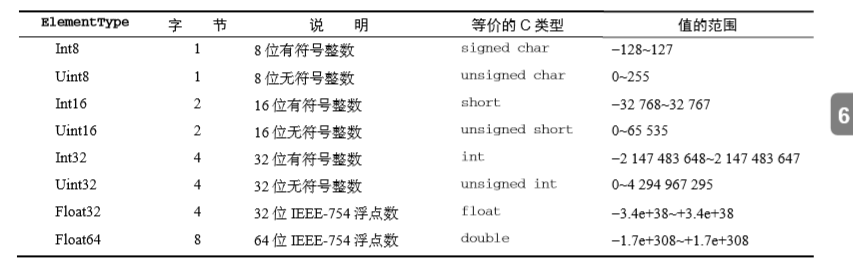
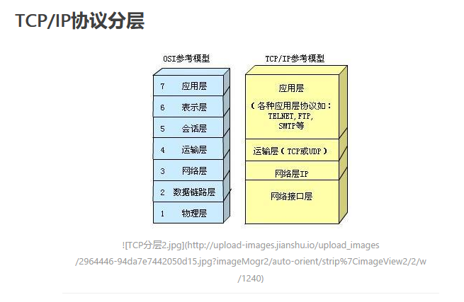

## Buffer 是什么
> Buffer对象用于固定长度的字节序列，Buffer对象是Unit8Array类的子类，且继承时带上了涵盖额外用例的方法。 只要支持 Buffer 的地方，Node.js API 都可以接受普通的 Uint8Array。是nodejs一个很重要的模块。
>> 那么什么是Unit8Array?
>> 它是一种定型数组，而定型数组是es新增的结构，目的是提升向原生库传输数据的效率，本质上是一种特殊的包含数值类型的数组。
>> 为了理解定型数组，我们有必要了解一下它的部分用途，也就是它的诞生历史
>> 
>> 我们先来了解一下webGL。
>> WebGL：最后的 JavaScript API是基于 OpenGL ES（OpenGL for Embedded Systems）2.0规范的。OpenGL ES 是 OpenGL专注于 2D和 3D计算机图形的子集。这个新 API被命名为 WebGL（Web Graphics Library）， 于 2011年发布 1.0版。用于编写涉及复杂图形的应用程序。
>> 但是在早期的WebGL版本中，JS数组与WebGL的原生数组并不匹配。JS的数组是默认双精度浮点格式（64位浮点格式存储），而WebGL并不支持（WebGL是32位）。于是，每次WebGL与js之间传递数组时，都不得不进行一次迭代，将数组转型为新的数组，这显然是要花费不少时间，对性能有很大的影响，这当然难以让人接受。
>> 于是便诞生了最初的定型数组---CanvasFloatArray，后来转变成现在的Float32Array(32位IEEE-754浮点数)，今天定型数组中可用的第一个类型。
>>
>> 定型数组实际上是一种“视图”，可以允许 JavaScript运行时访问一块名为 ArrayBuffer 的 预分配内存。ArrayBuffer 是所有定型数组及视图引用的基本单位(arrayBuffer 是一段包含特定数量字节的内存地址)
>> 
>> buffer 也是一种视图，用于访问arrayBuffer缓存区的数据
>> 
>> 看到这里，应该对buffer有了个初步的了解了。
>>
>> 我的总结: arrayBuffer 是一块预分配内存，里面存储的是一连串的0与1，你用Int8（8位有符号整数）的定型数组视图区读取，那就是每8字节地读取，读出的值的范围就是-128到127。
>> 下面是扩展，定型数组的类型
>> 
Buffer的讨论暂时先到这里

## Node.js net模块
1. net模块的功能是什么？
net模块用于创建基于流的TCP或IPC的服务器（net.createServer()）与客户端（net.createConnection()）

> TCP大家都知道，Transmission Control Protocol，传输控制协议，是一种面向连接的、可靠的、基于字节流的传输层通信协议。是七层网络模型的运输层。前端常用的http协议就是基于TCP协议的。IP位于网络层，TCP/IP，是一个协议族的统称。（包括IP协议，IMCP协议，TCP协议，以及我们更加熟悉的http、ftp、pop3协议等等）
> 
> 那么IPC又是什么呢？

2. IPC是什么
inter-Process Communication，进程间通信。TCP用于不同主机之间的信息交换，而IPC则用于同一主机进程间的通信。

> IPC支持: net模块在Windows上支持命名管道IPC，在其他操作系统上支持Unix域套接字。

3. net Server对象 用于创建TCP服务器或本地服务器。 net Socket对象是TCP或UNIX Socket的抽象，它实现了一个双工流接口。创建客户端时候使用。

> Socket 是对TCP/IP的一个抽象层，本身不是协议，是一组调用接口，也可以说是TCP/IP的api接口函数。

## stream 流模块

## http模块 http/2模块 https模块

## fs模块

## eventLoop


## express 
1. express的中间件
> 铺垫: 一个请求发送到服务器， 服务器需要: 监听请求-解析和处理请求-响应请求。有时候，监听与响应之间业务比较复杂，我们不得不把复杂的业务拆分成一个个子部分，子部分就是一个个的中间件。
> express的中间件
>> 执行任何代码
>> 修改请求和响应对象
>> 终结请求-响应循环 
>> 调用堆栈中的下一个中间件
>>> express的中间件，可以将多个回调函数传入，一个layer对象下，有个栈存储这些回调函数。若是只有一个回调，则直接执行。若是有多个回调，则是通过dispatch，调用堆栈中的函数。
```
const express = require('express')
const app = express(); 
app.use((req, res, next) => {
  req.time = 1; // 修改请求
  console.log('I am the first middleware')
  next() // 当前中间件没有结束请求/响应循环，而是调用next(),将数据传给下一个中间件函数
  console.log('first middleware end calling')
})
app.get('/', (req, res, next) => {
  console.log('I am the router middleware => /api/test1')
  res.send(req.time); // 结束请求/响应循环
})
// req 请求 res 响应 
```
express 中间件函数，帮助拆解主程序的业务逻辑，并且每一个的中间件函数处理的结果都会传递给下一个中间件函数。想象一下工厂上流水线工人，对一辆自行车的组装，一个安装轮子，一个安装车链，一个安装车把，。。。，这条流水线结束后，自行车就出炉了。
各做各的，不相互影响，又彼此协作。

> 分类
>> 应用级中间件(app.use)
>> 路由级中间件(router.use)
>> 错误处理中间件

>> 内置中间件

>> 第三方中间件

#### express唯一的内置中间件  static
static用于访问静态资源
```
// 唯一的内置中间件
const express = require('express')
const app = express(); 
app.use(express.static('public'));

// 可以调用两个不同文件夹的静态文件
// 按顺序调用静态文件  先遍历第一个public 然后才files

// 也可以创建虚拟路径（路径在文件系统中不存在）,为静态资源文件夹指定一个路径
app.use('/files',express.static('files'));
app.listen(8081)
```

#### express实现重定向
res.location()与res.redirect()
区别 res.redirect重定向的同时可以设置状态码  而res.location则不可以

```
var express = require('express');
var app = express();
app.get('/',function(req,res){
   //res.redirect('https://www.zhihu.com/question/358864006');// 状态码只有跳到外部网址的时候
   res.redirect('https://www.baidu.com', 303)
});
app.get('/admin',function(req,res){
   res.send('欢迎管理员');
});
app.get('/redirect', function(req, res){
   res.redirect('/admin', 303);
})
app.get('/admins', function(req, res){
   res.send('从location进入')
})
app.get('/location', function(req,res){
   res.location('/admins');
})
// location 一直失败
app.listen(8080,()=>{
   console.log('开始监听')
});
```

#### express 子程序挂载的路径模式
```
const express = require('express');
const app = express();
const admin = express();
const secret = express();
// 子程序挂载 有什么用？
// 可以用于多层级路由模式
// 基本用法
admin.get('/', (req, res) => {
  console.log(admin.mountpath);
  res.send('admin homepage');
})
admin.on('mount', (parent) => {
  console.log(Object.keys(parent), 'admin mount');
})
// events app.on 当子程序被挂载到父程序时 触发
secret.get('/', (req, res) => {
  console.log(secret.mountpath);
  res.send('secret admin');
})
admin.use('/secret', secret);
app.use(['/admin','/manage'], admin);

app.listen(8080)
```

#### express框架 实现反向代理
```
// 首先引入各个模块
const express = require('express');
const timeout = require('connect-timeout');
// 引入的是一个对象 而不是一个构造函数proxymiddle
const proxyMiddle = require('http-proxy-middleware').createProxyMiddleware;
const app = express();
// 不加的话 虽然能请求成功 但是会有警告
app.all('*', (req, res, next) => {
  res.header("Access-Control-Allow-Origin", "*");
  res.header("Access-Control-Allow-Headers", "X-Requested-With");
  res.header("Access-Control-Allow-Methods", "PUT,POST,GET,DELETE,OPTIONS");
  res.header("X-Powered-By", ' 3.2.1');
  // res.header("Content-Type", "application/json;charset=utf-8");
  console.log(Object.keys(res.sendDate),Object.keys(res.req.query))
  next();
})
//从环境变量读取配置 方便命令行启动
// host 目标地址
// port 服务端口
const { host="http://localhost:8080", port="3300" } = process.env;
console.log(proxyMiddle, 'proxy')
// 超时时间
const time_out = 30000;
// 设置端口
app.set('port', port);
app.use(timeout(time_out));
app.use((req, res, next) => {
  console.log(req.timedout);
  next();
})
app.use('/', express.static("files"));
// 反向代理配置
// 将'/api/test 代理到 ${host}/api/test'
console.log(host)
app.use( "/api/test", proxyMiddle({target:host, changeOrigin:true}) );
app.listen(app.get('port'), () => {
  console.log(`server running ${app.get('port')}`)
})
```
反向代理的作用
> 1. 安全仿佛
> 2. 负载均衡
> 3. 缓存静态内容，当静态内容发生变化时，通过内部通知机制通知反向代理服务器缓存失败，需重新加载
> 4. 能做到跨域 （但是警告是什么情况?）


## koa2
1. koa2的路由（路由：根据不同的URL地址，执行不同的逻辑，实现不同的功能）
> koa2的路由跟express不一样，它需要安装对应的koa-router模块实现


